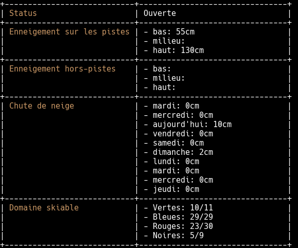

# Chione

[![License Apache 2][badge-license]](LICENSE)
[](https://badge.fury.io/gh/nlamirault%2Fchione)

* Master : [](https://circleci.com/gh/nlamirault/chione/tree/master)
* Develop : [](https://circleci.com/gh/nlamirault/chione/tree/develop)

This tool is a simple CLI to display informations about skiing resorts.




## Installation

You can download the binaries :

* Architecture i386 [ [linux](https://bintray.com/artifact/download/nlamirault/oss/chione-0.2.0_linux_386) / [darwin](https://bintray.com/artifact/download/nlamirault/oss/chione-0.2.0_darwin_386) / [freebsd](https://bintray.com/artifact/download/nlamirault/oss/chione-0.2.0_freebsd_386) / [netbsd](https://bintray.com/artifact/download/nlamirault/oss/chione-0.2.0_netbsd_386) / [openbsd](https://bintray.com/artifact/download/nlamirault/oss/chione-0.2.0_openbsd_386) / [windows](https://bintray.com/artifact/download/nlamirault/oss/chione-0.2.0_windows_386.exe) ]
* Architecture amd64 [ [linux](https://bintray.com/artifact/download/nlamirault/oss/chione-0.2.0_linux_amd64) / [darwin](https://bintray.com/artifact/download/nlamirault/oss/chione-0.2.0_darwin_amd64) / [freebsd](https://bintray.com/artifact/download/nlamirault/oss/chione-0.2.0_freebsd_amd64) / [netbsd](https://bintray.com/artifact/download/nlamirault/oss/chione-0.2.0_netbsd_amd64) / [openbsd](https://bintray.com/artifact/download/nlamirault/oss/chione-0.2.0_openbsd_amd64) / [windows](https://bintray.com/artifact/download/nlamirault/oss/chione-0.2.0_windows_amd64.exe) ]
* Architecture arm [ [linux](https://bintray.com/artifact/download/nlamirault/oss/chione-0.2.0_linux_arm) / [freebsd](https://bintray.com/artifact/download/nlamirault/oss/chione-0.2.0_freebsd_arm) / [netbsd](https://bintray.com/artifact/download/nlamirault/oss/chione-0.2.0_netbsd_arm) ]


## Usage

* CLI help:

        $ chione help
        NAME:
        chione - CLI for skiing resorts informations

        USAGE:
            chione [global options] command [command options] [arguments...]

        VERSION:
            0.1.0

        COMMANDS:
            version
            resorts
            resort
            help, h  Shows a list of commands or help for one command

        GLOBAL OPTIONS:
            --debug        Enable debug mode
            --help, -h     show help
            --version, -v  print the version


* Show skiing resorts for a country :

        $ chione --debug resorts list --country france
        Resorts:
        - le-markstein [vosges]
        - bussang---larcenaire [vosges]
        - saint-leger-les-melezes [alpes-du-sud]
        - turini-camp-d'argent- [alpes-du-sud]
        [...]


* Display informations about a ski resort:

        $ chione --debug resort describe --resort val-thorens --region alpes-du-nord
        +----------------------------+--------------------------------+
        | Status                     | Ouverte                        |
        +----------------------------+--------------------------------+
        | Enneigement sur les pistes | - bas: 55cm                    |
        |                            | - milieu:                      |
        |                            | - haut: 130cm                  |
        +----------------------------+--------------------------------+
        | Enneigement hors-pistes    | - bas:                         |
        |                            | - milieu:                      |
        |                            | - haut:                        |
        +----------------------------+--------------------------------+
        | Chute de neige             | - mardi: 0cm                   |
        |                            | - mercredi: 0cm                |
        |                            | - aujourd'hui: 10cm            |
        |                            | - vendredi: 0cm                |
        |                            | - samedi: 0cm                  |
        |                            | - dimanche: 2cm                |
        |                            | - lundi: 0cm                   |
        |                            | - mardi: 0cm                   |
        |                            | - mercredi: 0cm                |
        |                            | - jeudi: 0cm                   |
        +----------------------------+--------------------------------+
        | Domaine skiable            | - Vertes: 10/11                |
        |                            | - Bleues: 29/29                |
        |                            | - Rouges: 23/30                |
        |                            | - Noires: 5/9                  |
        +----------------------------+--------------------------------+

* Display metrics about a ski resort :

        $ chione --debug metrics export --config chione.toml

With configuration file :

```toml
# Chione configuration

# Ski Resorts
[[skiresorts]]
name = "peyragudes"
region = "pyrenees"

[[skiresorts]]
name = "cauterets"
region = "pyrenees"

[[skiresorts]]
name = "la-mongie-bareges"
region = "pyrenees"

[[skiresorts]]
name = "val-thorens"
region = "alpes-du-nord"
```

Metrics are :

```
# HELP chione_advanced Number of open advanced slopes.
# TYPE chione_advanced gauge
chione_advanced{name="cauterets"} 6
chione_advanced{name="la-mongie-bareges"} 15
chione_advanced{name="peyragudes"} 15
chione_advanced{name="val-thorens"} 27
# HELP chione_beginner Number of open beginner slopes.
# TYPE chione_beginner gauge
chione_beginner{name="cauterets"} 4
chione_beginner{name="la-mongie-bareges"} 16
chione_beginner{name="peyragudes"} 5
chione_beginner{name="val-thorens"} 11
# HELP chione_expert Number of open expert slopes.
# TYPE chione_expert gauge
chione_expert{name="cauterets"} 2
chione_expert{name="la-mongie-bareges"} 4
chione_expert{name="peyragudes"} 4
chione_expert{name="val-thorens"} 7
# HELP chione_intermediate Number of open intermediate slopes.
# TYPE chione_intermediate gauge
chione_intermediate{name="cauterets"} 9
chione_intermediate{name="la-mongie-bareges"} 21
chione_intermediate{name="peyragudes"} 22
chione_intermediate{name="val-thorens"} 29
# HELP chione_lower Snow depths at the lower of the ski resort
# TYPE chione_lower gauge
chione_lower{name="cauterets"} 240
chione_lower{name="la-mongie-bareges"} 120
chione_lower{name="peyragudes"} 140
chione_lower{name="val-thorens"} 139
# HELP chione_upper Snow depths at the upper of the ski resort.
# TYPE chione_upper gauge
chione_upper{name="cauterets"} 290
chione_upper{name="la-mongie-bareges"} 200
chione_upper{name="peyragudes"} 190
chione_upper{name="val-thorens"} 227
```

## Development

* Initialize environment

        $ make init

* Build tool :

        $ make build

* Launch unit tests :

        $ make test

## Contributing

See [CONTRIBUTING](CONTRIBUTING.md).


## License

See [LICENSE](LICENSE) for the complete license.


## Changelog

A [changelog](ChangeLog.md) is available


## Contact

Nicolas Lamirault <nicolas.lamirault@gmail.com>

[badge-license]: https://img.shields.io/badge/license-Apache2-green.svg?style=flat
